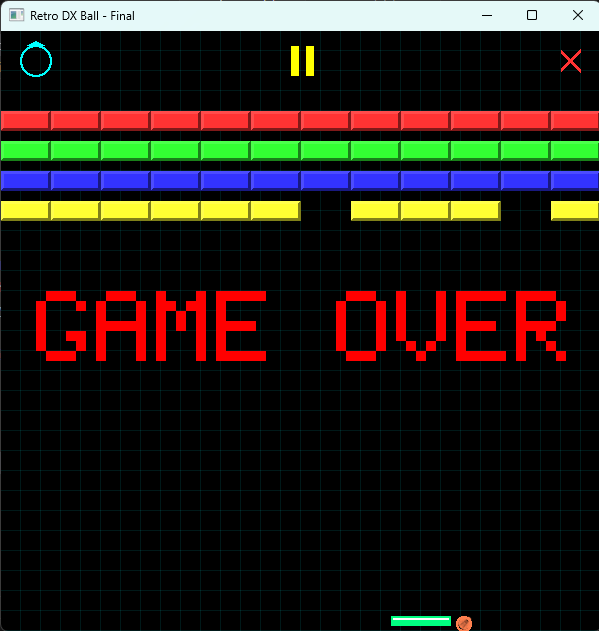

# Retro DX Ball Clone 🕹️

This project was originally developed as a coursework assignment for **CSE423 (Computer Graphics)**, where the primary focus was on implementing foundational concepts like rasterization algorithms and 2D game state management from scratch.

After completing the course requirements, I personally expanded and modified the project to give it a complete retro-futuristic visual overhaul, adding features like a dynamic starfield, glowing effects, and stylized pixel-art icons to create a more polished and engaging final product.

## Features
-   Classic block-breaking gameplay across two challenging levels.
-   Retro-futuristic aesthetic with a starfield background, glowing effects, and pixelated text.
-   Custom-coded graphics primitives using Midpoint algorithms for lines and circles.
-   Power-ups including Speed Up, Slow Down, and paddle size modifiers.

## How to Run
1.  Ensure you have Python 3 installed.
2.  Download the folder named 'OpenGL'
3.  Run the Retro Dx-Ball.py file

## Controls
-   **A**: Move paddle left
-   **D**: Move paddle right
-   **Mouse Click**: Navigate menus and use in-game buttons (Restart, Pause, Exit).
